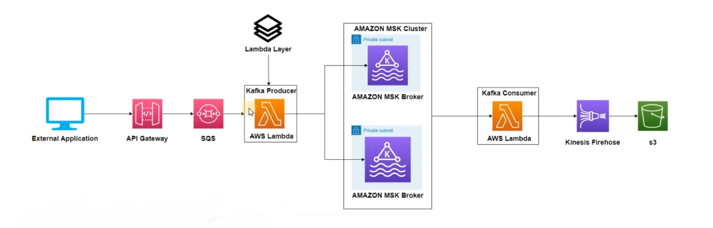
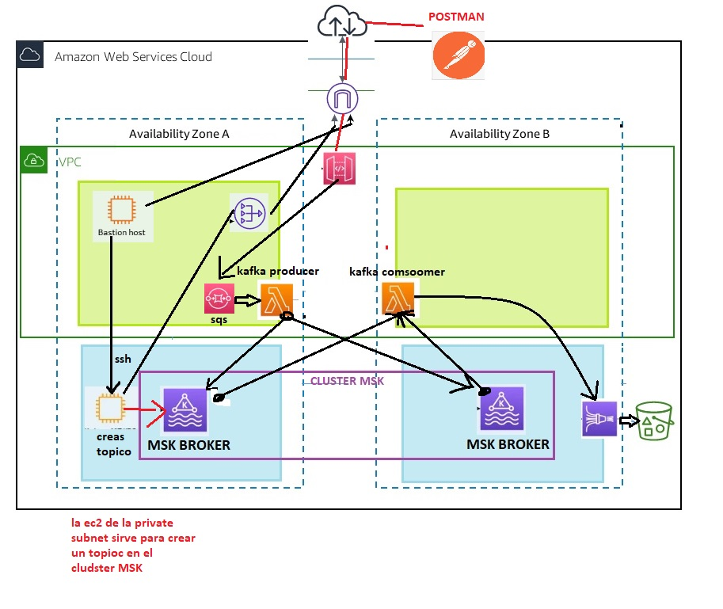

# aws_MSK_architechture_deployment_with_terraform
Deployment of an MSK architechture using Terraform, it deploys AWS resources integrated among them and with resources that already exist in AWS.

The following diagram explains the architechture:

Here is another diagram that explains how each resource interacts with each other:

The terraform files contain the deployments, which are ordered by resources.

terra_1.tf Contains the SQS and APIGateway resources and itnegration, as well as the providers to run the terraform files.

terra_2_MSK.tf Contains the deployment and configuration of the MSK as well as the resources that already exist taken from AWS (subnets and VPC on which the MSK clusters are going to be deployed).

terra_3_nat.tf Contains the deployment of the NatGateway and the necessary update of the Route Tables to give itnernet to the private subnets.

terra_4_lambda.tf Contains the triggering to the already existing lambda functions. 

terra_5_kinesis.tf Contains the Kinesis FireHose deployment and integration with the S3.

ec2_instances.tf Contains the deployment of the EC2 instances necessary to run Kafka. (you can only install Java but can't download resources and unzip them, for that ansible is the answer, or by doing it manually)

Already Existing resources: Lambda layer for the Lambda Consumer, Lambda Consumer and Lambda Producer, S3 Bucket, VPC and Subnets (private and Publics), Internet Gateway, route tables (which are updated in the "terra_3_nat.tf" file) and Keypairs.

